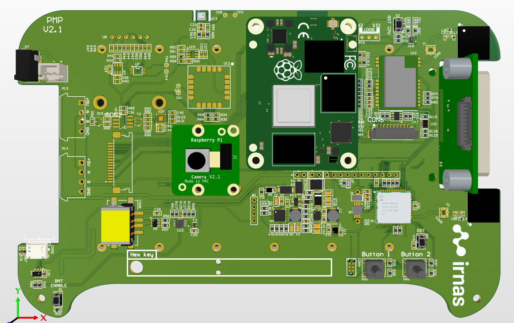
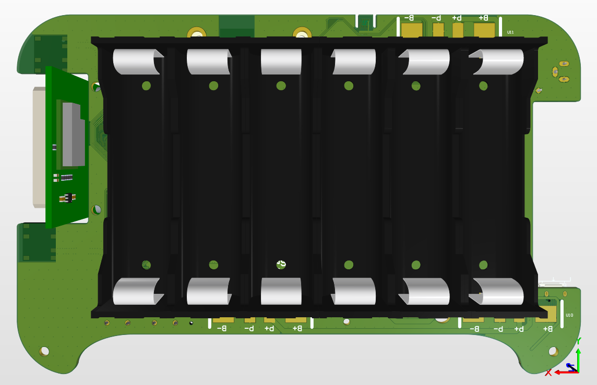

# Q42 PMP hardware

Q42 PMP is a standalone device featuring a Raspberry Pi and a Raspberry Pi Camera Module with a number of additonal features.

## Key user features
* Capture image/video at defined intervals
* Report system status/sensors via Lora (optional)
* Report system status/sensors via RockBlock Iridium (optional)
* Optional sensors:
  * Ultrasonic distance
  * Temperatures
  * GPS - location
* Power:
  * Batteries
  * Solar charging
* USB flash drive - user removable - contains all images and other captured data
  * contains images/videos
  * contains json with settings
* SD card with OS is read-only and not to be removed
* on/off switch
* 2x push button
  * button 1: test mode - push to turn on the system for 10 minutes
  * button 2: general purpose
* Test mode:
  * WiFi enabled, user can connect and check camera image or download all images
  * Each time test mode is enabled an image is taken.
* Bluetooth:
  * System status printout
  * Enable test mode
  * Configure settings
* Lora:
  * Enable test mode 
  * Configure settings
  * LacunaSpace communication
 
## License

All our projects are as usefully open-source as possible.

Hardware including documentation is licensed under [CERN OHL v.1.2. license](http://www.ohwr.org/licenses/cern-ohl/v1.2)

Firmware and software originating from the project is licensed under [GNU GENERAL PUBLIC LICENSE v3](http://www.gnu.org/licenses/gpl-3.0.en.html).

Open data generated by our projects is licensed under [CC0](https://creativecommons.org/publicdomain/zero/1.0/legalcode).

All our websites and additional documentation are licensed under [Creative Commons Attribution-ShareAlike 4 .0 Unported License](https://creativecommons.org/licenses/by-sa/4.0/legalcode).

What this means is that you can use hardware, firmware, software and documentation without paying a royalty and knowing that you'll be able to use your version forever. You are also free to make changes but if you share these changes then you have to do so on the same conditions that you enjoy.

Koruza, GoodEnoughCNC and IRNAS are all names and marks of Institut IRNAS Race. 
You may use these names and terms only to attribute the appropriate entity as required by the Open Licences referred to above. You may not use them in any other way and in particular you may not use them to imply endorsement or authorization of any hardware that you design, make or sell.